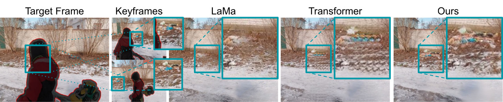

# Guided Inpainting



Many video editing tasks such as rotoscoping or object removal require the propagation of context across frames. While transformers and other attention-based approaches that aggregate features globally have demonstrated great success at propagating object masks from keyframes to the whole video, they struggle to propagate high-frequency details such as textures faithfully. We hypothesize that this is due to an inherent bias of global attention towards low-frequency features. To overcome this limitation, we present a two-stream approach, where high-frequency features interact locally and low-frequency features interact globally. The global interaction stream remains robust in difficult situations such as large camera motions, where explicit alignment fails. The local interaction stream propagates high-frequency details through deformable feature aggregation and, informed by the global interaction stream, learns to detect and correct errors of the deformation field. We evaluate our two-stream approach for inpainting tasks, where experiments show that it improves both the propagation of features within a single frame as required for image inpainting, as well as their propagation from keyframes to target frames. Applied to video inpainting, our approach leads to 44% and 26% improvements in FID and LPIPS scores.

[***Towards Unified Keyframe Propagation Models***](https://arxiv.org/abs/2205.09731)<br/>
Patrick Esser, Peter Michael, Soumyadip Sengupta


https://user-images.githubusercontent.com/2175508/169424205-be1ec110-be98-44a6-8ef7-0b8f4205435b.mp4


[Video results for all DAVIS sequences](https://k00.fr/atvnnaws).

## Requirements

```
conda env create -f env.yaml
conda activate guided-inpainting
```

Download the `raft-things.pth` checkpoint for
[RAFT](https://github.com/princeton-vl/RAFT) and place into
`checkpoints/flow/raft/raft-things.pth`.

Download the `encoder_epch_20.pth` checkpoint for the
`ade20k-resnet50dilated-ppm_deepsup` perceptual loss of
[LaMa](https://github.com/saic-mdal/lama) and place into
`checkpoints/lama/ade20k/ade20k-resnet50dilated-ppm_deepsup/encoder_epoch_20.pth`.

## Evaluation

To reproduce the results from Table 2, [download the validation data](https://k00.fr/cdl7mnix)
to `data/places365/lama/val_guided/`. [Download the desired pre-trained
checkpoint(s)](https://k00.fr/58ftv78q) and run

```
python gi/main.py --base configs/<model>.yaml --gpus 0, --train false --resume_from_checkpoint models/<model>.ckpt
```

To reproduce the results in Table 3, set up the [DEVIL
benchmark](https://github.com/MichiganCOG/devil), [download the pre-computed
results](TODO) and run DEVIL on it. Note that at the moment we do not plan to
release the propagation code.

## Training

Follow the [training split preparation of Places as in
LaMa](https://github.com/saic-mdal/lama#places) and place into
`data/places365/data_large`. Start the training with

```
python gi/main.py --base configs/<model>.yaml --gpus 0,1
```

## Shoutouts

- [RAFT](https://github.com/princeton-vl/RAFT)
- [LaMa](https://github.com/saic-mdal/lama)
- [FGVC](https://github.com/vt-vl-lab/FGVC)
- [DEVIL](https://github.com/MichiganCOG/devil)
